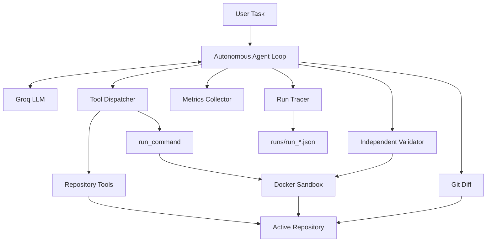

# Autonomous Coding Agent with Docker Sandbox

A lightweight autonomous software-engineering agent that can inspect an existing repository, reason about failures, edit source files, execute commands inside an isolated Docker sandbox, validate its own changes, retry after failed validation, and record detailed execution metrics and traces.

The project was built incrementally to make each layer of the agent architecture explicit rather than hiding orchestration behind an agent framework.

## Key Capabilities

- Groq-hosted LLM integration through a dedicated model wrapper
- Native tool/function calling
- Autonomous multi-step tool loop
- Repository-aware file inspection and editing
- Recursive repository tree inspection
- Shell execution inside disposable Docker containers
- CPU, memory, PID, network, filesystem and timeout restrictions
- Independent test-based validation before task completion
- Validation-feedback retry loop
- Git diff capture for final patch inspection
- Token, tool, runtime and validation metrics
- Persistent JSON execution traces
- Automated evaluation harness with protected-test integrity checks
- Infrastructure failures separated from actual coding-task failures

## Architecture



The LLM never directly executes shell commands. It requests a tool invocation, while the Python orchestration layer performs the requested action.

Arbitrary shell commands are routed through Docker rather than executed directly on the host.

## Project Evolution

```text
V0  LLM API
 ↓
V1  LLM + coding tools
 ↓
V2  Autonomous tool loop
 ↓
V3  Coding agent on a real mini repository
 ↓
V4  Docker sandbox
 ↓
V5  Retry + deterministic validation
 ↓
V6  Metrics + execution traces
 ↓
V7  Evaluation suite + polished project
```

### V0 — LLM API

Introduced a minimal Groq LLM wrapper.

### V1 — Coding Tools

Added repository operations:

```text
list_files
read_file
write_file
run_command
```

### V2 — Autonomous Tool Loop

The model independently decides which tool to call, what arguments to provide, how to use the returned observation, whether another action is required, and when it believes the task is complete.

### V3 — Repository-Level Agent

Extended the system from isolated files to an existing multi-file repository and added recursive repository inspection with `get_tree`.

### V4 — Docker Sandbox

Moved arbitrary command execution from the host into disposable Docker containers.

### V5 — Retry and Validation

Added an independent validator that runs the repository test suite when the model attempts to finish.

The model's claim of success is not sufficient. A task is accepted only after deterministic validation passes.

### V6 — Metrics and Tracing

Added LLM call counts, tool usage counts, files read and written, command executions, validation attempts, validation failures, token usage, runtime, sandbox execution counts, and JSON execution traces.

### V7 — Evaluation

Added a 15-task debugging benchmark and an automated evaluation runner.

The evaluator starts each task from a clean buggy baseline, creates a per-task Git baseline, verifies the original repository fails, runs the agent, independently reruns validation, checks that protected test files were not modified, and distinguishes infrastructure failures from coding-task failures.

## Repository Structure

```text
codingAgentProj/
├── src/
│   ├── __init__.py
│   ├── agent.py
│   ├── errors.py
│   ├── llm.py
│   ├── metrics.py
│   ├── sandbox.py
│   ├── tools.py
│   ├── tracing.py
│   ├── validator.py
│   └── workspace.py
├── sandbox/
│   └── Dockerfile
├── workspace/
│   └── sample_repo/
├── evaluation/
│   ├── evaluate.py
│   ├── tasks/
│   │   ├── task01_calculator_subtract/
│   │   ├── ...
│   │   └── task15_boolean_serialization/
│   └── results/
├── runs/
│   └── run_*.json
├── main.py
├── requirements.txt
├── .env
├── .gitignore
└── README.md
```

## Agent Workflow

For a task such as:

```text
Fix the failing tests in this repository.
```

a typical trajectory is:

```text
User task
   ↓
Inspect repository tree
   ↓
Read relevant source/tests
   ↓
Run tests in Docker
   ↓
Observe failure
   ↓
Modify source
   ↓
Run tests again
   ↓
Review final Git diff
   ↓
Attempt completion
   ↓
Independent validator
   ↓
PASS → return final answer
FAIL → feed failure back to agent and continue
```

The autonomous loop is bounded by a maximum step count to prevent uncontrolled execution.

## Tools

The model currently has access to:

- `get_tree`
- `list_files`
- `read_file`
- `write_file`
- `run_command`
- `git_diff`

File tools are restricted to the active repository using resolved-path checks.

## Docker Sandbox

LLM-selected shell commands are never executed directly on the host.

Each command is executed in a fresh disposable Docker container with the active repository mounted at:

```text
/workspace
```

The sandbox applies:

- no network access,
- memory limits,
- CPU limits,
- PID limits,
- dropped Linux capabilities,
- `no-new-privileges`,
- read-only container filesystem,
- temporary writable `/tmp`,
- execution timeout,
- automatic container deletion,
- host UID/GID mapping when available.

Conceptually:

```text
Agent
  ↓
run_command("python -m pytest -q")
  ↓
Docker container
  ↓
/workspace
  ↓
test execution
  ↓
stdout + stderr + exit code
  ↓
Agent observation
```

The repository itself is bind-mounted so source changes persist while the disposable execution environment does not.

## Validation

When the model attempts to finish, `RepositoryValidator` independently runs the configured validation command:

```bash
python -m pytest -q
```

If validation fails, the failure output is returned to the model and the agent continues working.

```text
Agent proposes completion
        ↓
Independent validator
        ↓
     PASS / FAIL
      ↓      ↓
   finish   feedback
              ↓
            retry
```

Validation retries and total agent steps are independently bounded.

## Observability

Every run records aggregate metrics and a chronological trace.

Example report:

```text
========== AGENT REPORT ==========

Task solved:              YES
Steps:                    6
LLM calls:                6
Tool calls:               5

Unique files read:        2
Unique files written:     1
File read calls:          2
File write calls:         1

Agent command calls:      1
Validation executions:    1
Total sandbox executions: 2

Validation attempts:      1
Failed validations:       0
First-attempt success:    YES
Validation Recovery:      NO

Input tokens:             ...
Output tokens:            ...
Total tokens:             ...

Runtime:                  ... sec
Trace:                    runs/run_....json
```

Execution traces are persisted as JSON and record events such as:

```text
run_started
llm_response
tool_call
validation
validation_feedback
final_git_diff
run_finished
```

## Evaluation Benchmark

The final system was evaluated on a custom 15-task Python debugging suite covering:

- incorrect arithmetic logic,
- recursive base cases,
- off-by-one errors,
- data transformation,
- retry semantics,
- state mutation,
- text parsing,
- sorting,
- boolean validation,
- interval boundary handling,
- graph traversal,
- nested configuration merging,
- LRU eviction,
- sliding windows,
- Python type handling.

The evaluation runner:

1. copies a clean task into the active workspace,
2. creates a task-specific Git baseline,
3. verifies the buggy baseline fails,
4. runs the autonomous agent,
5. reruns validation independently,
6. hashes protected test files before and after execution,
7. rejects solutions that modify protected tests,
8. records task outcome and metrics.

### Benchmark Results

| Metric | Result |
|---|---:|
| Tasks discovered | 15 |
| Valid benchmark tasks | 15 |
| Completed agent runs | 15 |
| Solved | 15 |
| Task failures | 0 |
| Infrastructure failures | 0 |
| Resolution rate | 100.0% |
| End-to-end completion rate | 100.0% |
| First-validation success rate | 100.0% |
| Validation recovery rate | N/A |
| Average steps per task | 6.73 |
| Average LLM calls per task | 6.73 |
| Average tool calls per task | 5.73 |
| Average tokens per task | 8,204 |
| Average runtime per task | 44.53 s |
| Median runtime per task | 44.96 s |
| Average sandbox executions per task | 2.40 |

These results apply specifically to this custom 15-task Python debugging benchmark and should not be interpreted as general software-engineering accuracy.

## Infrastructure Failure Classification

Provider failures are classified separately from task-solving failures.

Examples include:

```text
connection_error
rate_limit
provider_server_error
provider_transient_error
```

This allows the evaluator to distinguish `task_failure` from `infrastructure_failure`.

## Installation

### Requirements

- Python 3.12+
- Docker
- Git
- Groq API key

Clone the repository:

```bash
git clone <your-repository-url>
cd codingAgentProj
```

Create and activate an environment. For example:

```bash
conda create -n coding-agent python=3.12
conda activate coding-agent
```

Install dependencies:

```bash
pip install -r requirements.txt
```

Create a `.env` file:

```env
GROQ_API_KEY=your_groq_api_key_here
```

Do not commit `.env`.

## Build the Sandbox

From the project root:

```bash
docker build -t coding-agent-sandbox:latest -f sandbox/Dockerfile sandbox
```

Verify the image:

```bash
docker images
```

## Run the Agent

Place or configure the active repository under:

```text
workspace/sample_repo/
```

Then run:

```bash
python main.py
```

Example task:

```text
Fix the failing tests in this repository.
```

## Run the Evaluation Suite

Run one task:

```bash
python evaluation/evaluate.py --task task01_calculator_subtract
```

Run the first few tasks:

```bash
python evaluation/evaluate.py --limit 3
```

Run all tasks:

```bash
python evaluation/evaluate.py
```

Evaluation summaries are written under:

```text
evaluation/results/
```

Execution traces are written under:

```text
runs/
```

## Model

The current implementation uses:

```text
openai/gpt-oss-20b
```

through the Groq API.

The provider is isolated behind `LLMClient`, so the rest of the agent does not depend directly on Groq-specific response handling.

## Design Decisions

### No Agent Framework

The autonomous loop, tool dispatch, validation and tracing are implemented directly in Python.

This keeps the control flow explicit:

```text
LLM response
→ tool request
→ tool execution
→ observation
→ next LLM call
```

### Separate Agent and Execution Layers

`agent.py` does not need to know how Docker works:

```text
agent.py
   ↓
tools.py
   ↓
sandbox.py
```

### Deterministic Validation

The LLM is not trusted to determine whether its own patch is correct. Task success is based on repository validation.

### Disposable Command Environments

A fresh Docker container is created for each shell command while the repository persists through a bind mount.

### Structured Execution Results

Sandbox execution exposes structured values including:

```text
exit code
stdout
stderr
timeout status
infrastructure status
```

instead of requiring the validator to parse human-readable strings.

## Security Scope

This project demonstrates practical sandboxing for an autonomous coding-agent prototype, but it should not be treated as a hardened multi-tenant execution service.

The current design provides meaningful isolation through Docker and restricts filesystem tools to the active repository, but production-grade untrusted execution would require additional hardening and operational controls.

## Limitations

- Evaluation is focused on small Python repositories.
- The default validator uses pytest.
- Repository context is obtained through direct file inspection rather than semantic indexing.
- File edits currently rewrite complete files rather than applying structured patches.
- Dependency installation is not automated.
- There is no long-term agent memory.
- The evaluation benchmark is custom and intentionally small.
- Benchmark results are not directly comparable to SWE-bench or other standardized coding-agent benchmarks.

## Future Work

Possible extensions include:

- targeted patch/apply-diff editing,
- automatic validation-command detection,
- support for C++, JavaScript and additional repository types,
- repeated benchmark trials and pass@k metrics,
- broader task suites,
- failure-category analysis,
- model comparisons,
- token/cost efficiency comparisons,
- repository search tools,
- persistent per-task sandbox sessions,
- standardized benchmarks such as selected SWE-bench tasks,
- richer execution visualizations.

## What This Project Demonstrates

The project demonstrates:

- LLM tool/function calling,
- autonomous agent loops,
- iterative perception-action reasoning,
- repository-level code manipulation,
- sandboxed code execution,
- deterministic validation,
- retry and recovery,
- observability and tracing,
- token/runtime/tool metrics,
- Git-based change inspection,
- reproducible agent evaluation,
- separation of agent failures from infrastructure failures.

## Summary

The final system is a small but complete autonomous coding agent:

```text
Natural-language task
        ↓
Repository inspection
        ↓
Autonomous tool selection
        ↓
Code modification
        ↓
Docker-based execution
        ↓
Test feedback
        ↓
Iterative correction
        ↓
Independent validation
        ↓
Git diff + metrics + trace
```

On the custom 15-task debugging benchmark used in this project, the final build solved all 15 tasks with independent test-based verification.
